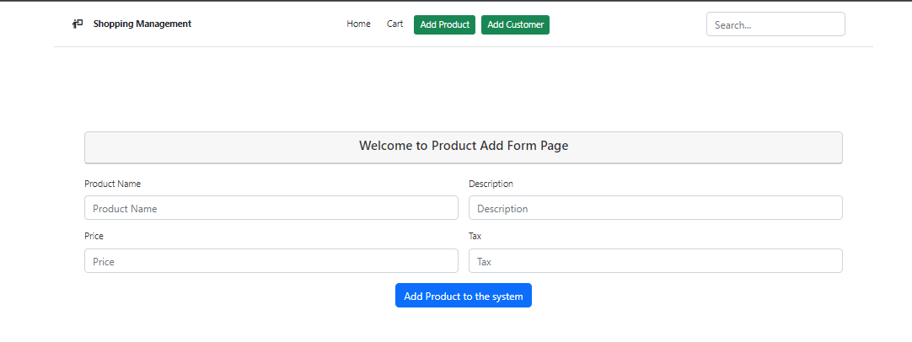
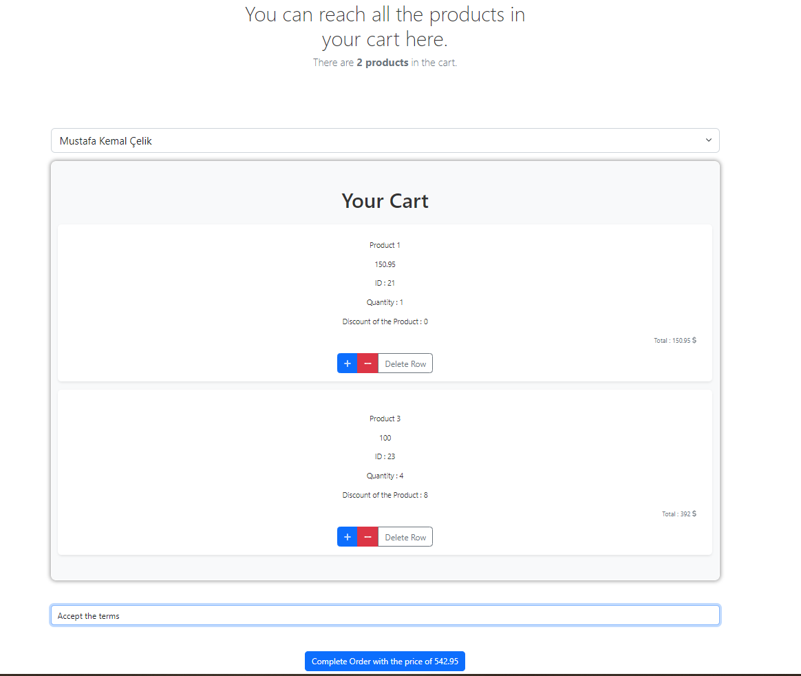
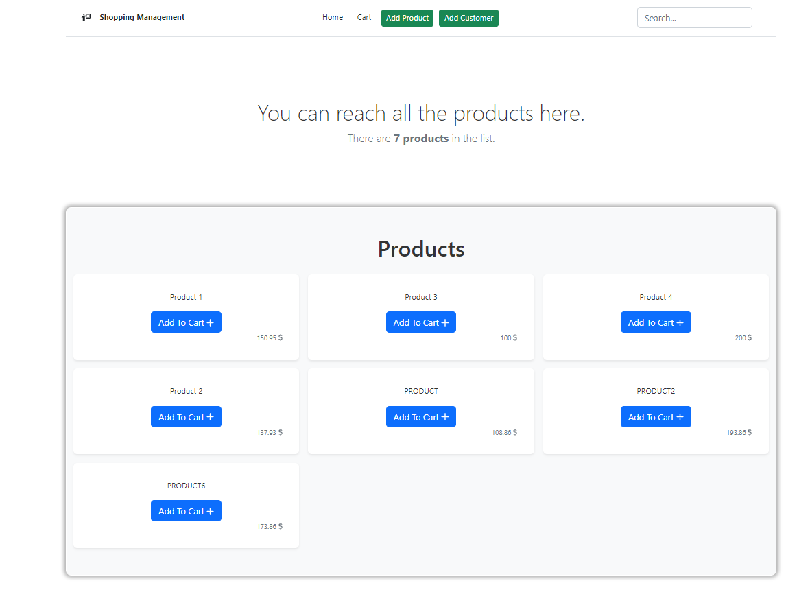

# Angular

This is a front-end side of the project that integrated APIs with services,models and components.

In the Angular front-end folder;

## Components

- add-customer ( Adding customer interface )
- add-product ( Adding product interface )
- cart
- navbar
- product ( Dashboard ) components created and integrated with the services.

## Models

- cart.ts
- customer.ts
- order_details.ts
- product.ts

## Services

- cart.service.ts
- customer.service.ts
- product.service.ts
 
## Routings
``` 
{path:"",component:ProductComponent},
{path:"add-product",component:AddProductComponent},
{path:"add-customer",component:AddCustomerComponent},
{path:"cart",component:CartComponent},
{path:"add-one-item/:productAddId",component:ProductComponent},
{path:"delete-one-item/:productDeleteId",component:ProductComponent},
{path:"delete-cart-row/:rowDelete",component:CartComponent},
```


## Install Dependencies ##
- ```npm install -g @angular/cli```
- ```ng add @ng-bootstrap/ng-bootstrap```
- ```npm i @fortawesome/fontawesome-free```

## Run ##
- ```ng serve --open```

# Example images
<p align="center">
  
  
  
</p>
