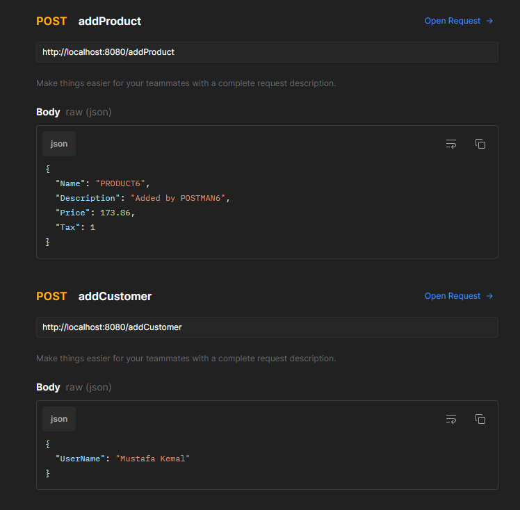

# Final Project of Property Finder Go Bootcamp

This project is a final project for the property finder company.

With this project you can;

- Show all the products  -->  ```http://localhost:8080/products  ( GET )```
- Show all the cart items  -->  ```http://localhost:8080/cart  ( GET )```
- Show all the customers  --> ```http://localhost:8080/customers  ( GET )```
- Show the product by using productid  --> ```http://localhost:8080/getProductById/{id}  ( GET )```
- Add product to the system  --> ```http://localhost:8080/addProduct  ( POST )```
- Add customer to the system  --> ```http://localhost:8080/addCustomer  ( POST )```
- Add products into the cart with quantity  --> ```http://localhost:8080/addToCart/{id}  ( POST )```
- Add one item into the cart  --> ```http://localhost:8080/addOneItemToCart/{id}  ( POST )```
- Delete an item from cart  --> ```http://localhost:8080/deleteOneItemFromCart/{id}  ( DELETE )```
- Delete the row from cart  --> ```http://localhost:8080/deleteAllCart/{id}  ( DELETE )```

# Example Postman APIs usage images for each API
<p align="center">
  
  
  
  
</p>
